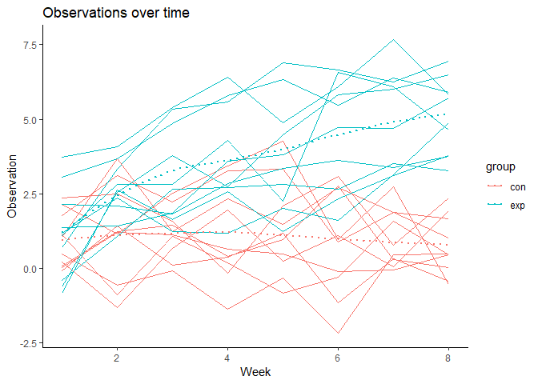
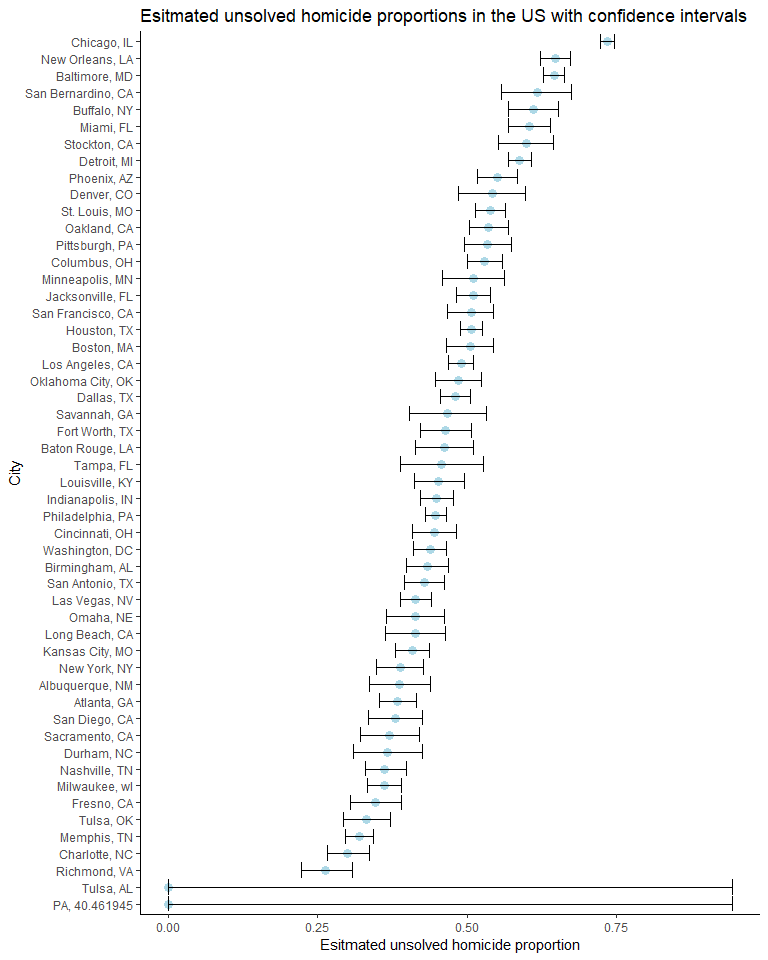

hw5
================
Jiawei Ye

### Problem 1

#### Load and tidy data

``` r
longi_study = as.data.frame(list.files(path = "./data/problem1")) %>% 
  janitor::clean_names() %>% 
  rename(file_name = list_files_path_data_problem1)

read_data = function(csv_name){
  csv_name = str_c("./data/problem1/", as.character(csv_name))
  read.csv(csv_name)
}

longi_study = 
  add_column(longi_study, data = map(longi_study[[1]], read_data)) %>% 
  unnest()

##alternatively the code below gives the unnested result directly
#longi_study = bind_cols(longi_study, map_df(.x = longi_study[[1]], ~read_data(.x)))
```

Now tidy the data... a bit

``` r
longi_study =
  rename(longi_study, subject = file_name) %>% 
  mutate(subject = as.character(subject), 
         subject = str_trunc(subject, 6,  ellipsis = "")) %>% 
  separate(subject, into = c("group", "id"), remove = FALSE)
```

#### Spaghetti plot

``` r
longi_study %>% 
  gather(c(week_1:week_8), key = "week", value = "value") %>% 
  mutate(week = str_trunc(week, side = "left", 1, ellipsis = ""), 
         week = as.numeric(week)) %>% 
  ggplot(aes(x = week, y = value)) +
  geom_line(aes(color = subject), linetype = 1) +
  geom_smooth(aes(color = group), linetype = 3, se = FALSE) +
  labs(title = "Observations over time", 
       x = "Week", 
       y = "Observation") +
  theme_classic() 
```

    ## `geom_smooth()` using method = 'loess' and formula 'y ~ x'



The plot shows that there are some variations within each arm. The overall trend is that the observations of the treatment arm increase over time while the observations of the control arm decrease or remain the same over time.

### Problem 2

#### Load and tidy data

``` r
homi_data = read.csv("./data/problem2/homicide-data.csv") %>% 
  unite(city, state, col = "city_state", sep = ", ")
```

The raw data set has 11 columns and 52179 observations. Each observation represents a victim in the homicide. The data lists the homicides across the major cities in U.S, including the date, city and state where each homicide happened (with its coordinates). The data set also includes information about the victims - their name, race, age and gender. The news article is most concerned about whether the homicide has been solved, which is listed as a variable "disposition".

``` r
total_homi =  
  homi_data %>% 
    group_by(city_state) %>% 
    summarize(homicide = n())

unsolved_homi = 
  homi_data %>% 
    filter(disposition == "Closed without arrest" | 
           disposition == "Open/No arrest") %>% 
    group_by(city_state) %>% 
    summarize(unsolved_homicide = n())  

summarize_homi = 
  left_join(total_homi, unsolved_homi, by = "city_state") %>% 
  replace_na(list(unsolved_homicide = 0))
summarize_homi %>% 
  knitr::kable()
```

| city\_state        |  homicide|  unsolved\_homicide|
|:-------------------|---------:|-------------------:|
| Albuquerque, NM    |       378|                 146|
| Atlanta, GA        |       973|                 373|
| Baltimore, MD      |      2827|                1825|
| Baton Rouge, LA    |       424|                 196|
| Birmingham, AL     |       800|                 347|
| Boston, MA         |       614|                 310|
| Buffalo, NY        |       521|                 319|
| Charlotte, NC      |       687|                 206|
| Chicago, IL        |      5535|                4073|
| Cincinnati, OH     |       694|                 309|
| Columbus, OH       |      1084|                 575|
| Dallas, TX         |      1567|                 754|
| Denver, CO         |       312|                 169|
| Detroit, MI        |      2519|                1482|
| Durham, NC         |       276|                 101|
| Fort Worth, TX     |       549|                 255|
| Fresno, CA         |       487|                 169|
| Houston, TX        |      2942|                1493|
| Indianapolis, IN   |      1322|                 594|
| Jacksonville, FL   |      1168|                 597|
| Kansas City, MO    |      1190|                 486|
| Las Vegas, NV      |      1381|                 572|
| Long Beach, CA     |       378|                 156|
| Los Angeles, CA    |      2257|                1106|
| Louisville, KY     |       576|                 261|
| Memphis, TN        |      1514|                 483|
| Miami, FL          |       744|                 450|
| Milwaukee, wI      |      1115|                 403|
| Minneapolis, MN    |       366|                 187|
| Nashville, TN      |       767|                 278|
| New Orleans, LA    |      1434|                 930|
| New York, NY       |       627|                 243|
| Oakland, CA        |       947|                 508|
| Oklahoma City, OK  |       672|                 326|
| Omaha, NE          |       409|                 169|
| PA, 40.461945      |         1|                   0|
| Philadelphia, PA   |      3037|                1360|
| Phoenix, AZ        |       914|                 504|
| Pittsburgh, PA     |       630|                 337|
| Richmond, VA       |       429|                 113|
| Sacramento, CA     |       376|                 139|
| San Antonio, TX    |       833|                 357|
| San Bernardino, CA |       275|                 170|
| San Diego, CA      |       461|                 175|
| San Francisco, CA  |       663|                 336|
| Savannah, GA       |       246|                 115|
| St. Louis, MO      |      1677|                 905|
| Stockton, CA       |       444|                 266|
| Tampa, FL          |       208|                  95|
| Tulsa, AL          |         1|                   0|
| Tulsa, OK          |       583|                 193|
| Washington, DC     |      1345|                 589|

#### Homicide in Baltimore, MD

The following code chunk produces the estimated proportion of unsolved homicide in Baltimore, MD and its confidence interval.

``` r
test_baltimore = 
  filter(summarize_homi, city_state == "Baltimore, MD") %>% 
  select(-city_state) %>% 
  select(unsolved_homicide, homicide)

test_result = prop.test(test_baltimore[[1]], test_baltimore[[2]]) %>% 
  broom::tidy()

test_result %>% pull(1)
```

    ## [1] 0.6455607

``` r
ci = c(test_result %>% pull(5), test_result %>% pull(6))
ci
```

    ## [1] 0.6275625 0.6631599

#### Homicide across US

Do the testing.

``` r
test_function = function(unsolved, total){
  result = prop.test(unsolved, total) %>% broom::tidy()
  esti_pro = round(result %>% pull(1), digits = 3)
  ci_low = round(result %>% pull(5), digits = 3)
  ci_high = round(result %>% pull(6), digits = 3)
  tibble(esti_pro, ci_low, ci_high)
}

homi_us = 
  map2(.x = summarize_homi[[3]], .y = summarize_homi[[2]], ~test_function(.x, .y)) %>%
  bind_rows() %>% 
  mutate(city_state = summarize_homi[[1]]) %>% 
  select(city_state, esti_pro, ci_low, ci_high)
```

    ## Warning in prop.test(unsolved, total): Chi-squared approximation may be
    ## incorrect

    ## Warning in prop.test(unsolved, total): Chi-squared approximation may be
    ## incorrect

Get a plot.

``` r
homi_us %>% 
  ggplot(aes(x = fct_reorder(city_state,esti_pro), y = esti_pro)) +
    geom_point(color = "light blue", size = 3) +
    geom_errorbar(aes(ymin = ci_low, ymax = ci_high)) +
    coord_flip() +
    labs(title = "Esitmated unsolved homicide proportions in the US with confidence intervals", 
         x = "City", 
         y = "Esitmated unsolved homicide proportion") +
    theme_classic()
```



The plot shows Chicago, IL has the highest estimated unsolved homicide proportions, followed by New Orleans, LA and Baltimore, MD.
